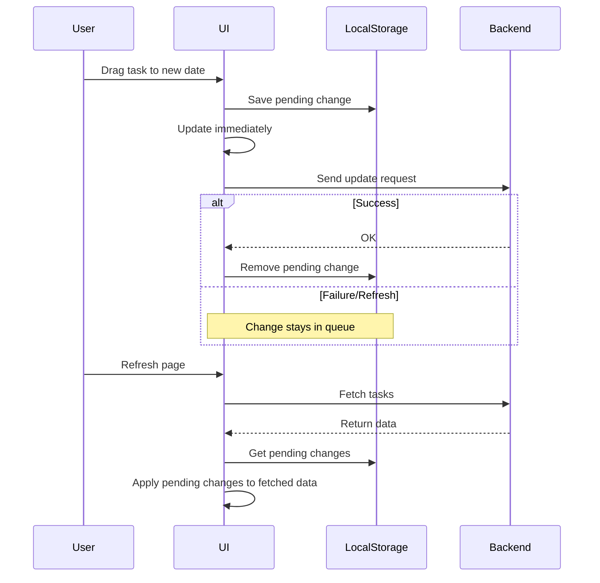

Demo website:

Note - Refreshing the page will reset the data.
https://shreeshrd.github.io/myToDo/

Project Details -
Front end and backend interact through a REST API.
Front end is a clone of a popular To Do list app. 
Backend developed with Spring-Boot and Jakarata API to connect to MySQL.

## Pending Changes Cache System

The frontend implements a localStorage-based pending changes cache to ensure task updates persist across page refreshes, even if backend sync hasn't completed yet.



Installation notes -
Run frontend with:
```
npm i
npm start
```
Pre-Requisites - 
Java Version 21
MySQL instance running with an existing database called tododb
Add your MySQL username and password in this file:
 - backend-springboot/src/main/resources/application.properties
