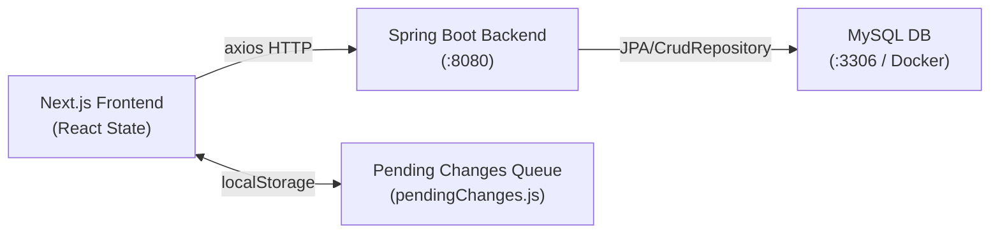

# Frontend → Backend → Database Flow Analysis
## Focus: Unsaved Changes & Data Revert on Refresh

---

## Architecture Overview



**Key layers:**
| Layer | File(s) | Role |
|---|---|---|
| UI Components | [TodayView.js](file:///home/agent/projects/myToDo/frontend-next/components/TodayView.js), [ToDoDay.js](file:///home/agent/projects/myToDo/frontend-next/components/ToDoDay.js), [CalendarView.js](file:///home/agent/projects/myToDo/frontend-next/components/CalendarView.js) | Renders tasks, triggers drag callbacks |
| Context/Orchestrator | [TaskContext.js](file:///home/agent/projects/myToDo/frontend-next/contexts/TaskContext.js) | Provides state and callbacks to all components; owns [handleDragEnd](file:///home/agent/projects/myToDo/frontend-next/contexts/TaskContext.js#183-221) |
| State Hook | [useTaskManagement.js](file:///home/agent/projects/myToDo/frontend-next/hooks/useTaskManagement.js) | Holds `taskDays`, `overdueTasks`, `completedTasks`; owns all mutation functions |
| Persistence Fallback | [lib/pendingChanges.js](file:///home/agent/projects/myToDo/frontend-next/lib/pendingChanges.js) | localStorage queue that re-applies lost changes on refresh |
| API Layer | [service.js](file:///home/agent/projects/myToDo/frontend-next/service.js) | Thin axios wrappers for the backend REST API |
| REST Controller | [TodoRestController.java](file:///home/agent/projects/myToDo/backend-springboot/src/main/java/com/myapp/todo/TodoRestController.java) | Endpoints: `/add`, `/update`, `/delete`, `/allbydate` |
| Service | [TodoService.java](file:///home/agent/projects/myToDo/backend-springboot/src/main/java/com/myapp/todo/TodoService.java) | Business logic, field switching |
| DB Repository | [TodoItemRepository.java](file:///home/agent/projects/myToDo/backend-springboot/src/main/java/com/myapp/todo/TodoItemRepository.java) | Spring Data CrudRepository over MySQL |

---

## Flow 1: Page Load / Refresh

```
Browser refresh
 └─► useTaskManagement.js: useEffect → fetchTasks()
      └─► service.js: getTasks("bydate") → GET /todo/allbydate
           └─► TodoService.getGroupedByDate()
                └─► repository.findAll() → MySQL SELECT all
                     └─► Returns GroupedTodoItems { itemsByDate: { "YYYY-MM-DD": [tasks...] } }
      └─► Frontend sorts by dayOrder, splits into taskDays / overdueTasks / completedTasks
      └─► lib/pendingChanges.js: applyPendingChanges() overlays localStorage queue on top
      └─► setTaskDays(), setOverdueTasks() → React re-render
```

> [!IMPORTANT]
> This is the **root cause** of all revert issues. Every refresh calls `fetchTasks()`. If backend is unreachable or returns stale data, and [pendingChanges.js](file:///home/agent/projects/myToDo/frontend-next/lib/pendingChanges.js) restoration also has a bug, the UI reverts. The entire persistence-on-refresh story relies on the **localStorage queue + [applyPendingChanges](file:///home/agent/projects/myToDo/frontend-next/lib/pendingChanges.js#78-227)** working perfectly.

---

## Flow 2: Drag & Drop — Cross-Day Move (Primary Failure Point)

### Step-by-step trace:

```
User drags task from Day A → Day B
 └─► react-beautiful-dnd fires onDragEnd(result)
      └─► TaskContext.handleDragEnd(result)
           ├─► Parses destination.droppableId → destDate (e.g., "2026-03-06")
           ├─► Gets filteredTaskDays[destDate] (PROJECT-FILTERED view)
           └─► calculatePredecessor(destination, source, filteredDestTasks) → predecessorTaskId
                └─► dragUtils.js: predecessor = filteredDestTasks[destIndex - 1]
           └─► taskManagement.moveTask(draggableId, destDate, predecessorTaskId)
                ├─► [1] addPendingChange({ type:'MOVE_TASK', taskId, sourceDate, destDate, predecessorTaskId, taskData })
                ├─► [2] Calculates updatedDestList in-memory (inserts, re-numbers dayOrder)
                ├─► [3] setOverdueTasks() / setTaskDays() → optimistic UI update
                └─► [4] ASYNC - Fire and forget:
                     ├─► updateField(taskId, "taskDate", destDate)    ← changes date in DB
                     └─► FOR EACH task in updatedDestList:
                          └─► updateField(t.id, "dayOrder", i+1)     ← sets order in DB
                     └─► On ALL success: removePendingChange(pendingId)
                     └─► On ANY failure: pending change stays in queue
```

### Point of Failure Analysis — Cross-Day Move:

| # | Point of Failure | Scenario | Effect on Refresh |
|---|---|---|---|
| **F1** | `droppableId` parsing | `parseInt("tasks__list10".replace("tasks__list",""))` — if ID format changes, `destDate` is `NaN`, `destDate` becomes `"Invalid Date"`, task lands in a phantom date | Task disappears from UI on refresh (it's in DB with a bad date) |
| **F2** | [calculatePredecessor](file:///home/agent/projects/myToDo/frontend-next/lib/dragUtils.js#2-37) uses **filtered** list | If project filter is active, `filteredDestTasks` only contains visible tasks. The predecessor found belongs to the filtered subset; however [moveTask](file:///home/agent/projects/myToDo/frontend-next/hooks/useTaskManagement.js#346-470) operates on the **unfiltered** `taskDays`. The insert position is correct only if the filtered predecessor index maps correctly to the unfiltered list. | Task reorders to the wrong position after refresh |
| **F3** | [moveTask](file:///home/agent/projects/myToDo/frontend-next/hooks/useTaskManagement.js#346-470) reads `taskDays` via closure (stale state) | [moveTask](file:///home/agent/projects/myToDo/frontend-next/hooks/useTaskManagement.js#346-470) is called from [handleDragEnd](file:///home/agent/projects/myToDo/frontend-next/contexts/TaskContext.js#183-221). The `currentDestList` is built from `taskDays[destDate]` captured at call time. If a previous async update hasn't settled in React state, `taskDays` may be stale (e.g., a rapid second drag). | DB gets wrong `dayOrder` values; order reverts on refresh |
| **F4** | `Promise.all` for dayOrder updates — partial failure | N [updateField](file:///home/agent/projects/myToDo/frontend-next/service.js#22-45) calls are fired for N tasks. If WSL hibernates mid-flight, some succeed and some fail. The pending change is NOT removed (the `.catch` fires), which is correct — **but the DB is now in a partially-updated state**. On refresh, [applyPendingChanges](file:///home/agent/projects/myToDo/frontend-next/lib/pendingChanges.js#78-227) re-applies the full MOVE_TASK, but the DB already has the new `taskDate`. Result: task appears twice or in wrong order. | Task in wrong position after reconnect |
| **F5** | [applyPendingChanges](file:///home/agent/projects/myToDo/frontend-next/lib/pendingChanges.js#78-227) MOVE_TASK replay logic — source date stale | When replaying from `pendingChanges`, the function tries to find the task at `sourceDate`. But since the task was already moved to `destDate` by the partial backend write, it won't exist at `sourceDate`. It then iterates all dates and may find it at `destDate`, creating a no-op or double insert. | Task position incorrect after reconnect & refresh |
| **F6** | [updateField](file:///home/agent/projects/myToDo/frontend-next/service.js#22-45) sends `value.toString()` | In [service.js](file:///home/agent/projects/myToDo/frontend-next/service.js), every field value is coerced to [toString()](file:///home/agent/projects/myToDo/backend-springboot/src/main/java/com/myapp/todo/TodoItem.java#43-49) before sending. `dayOrder` is an integer; this is fine. But `taskDate` as a string `"2026-03-06"` passes correctly. This is not a bug by itself, but if any value is `null` or `undefined`, `.toString()` throws. | Could silently drop the update if called with nullish values |

---

## Flow 3: Drag & Drop — Reorder Within Same Day (Secondary Failure Point)

### Step-by-step trace:

```
User drags task from position 2 → position 4 within same day
 └─► handleDragEnd: source.droppableId === destination.droppableId
      └─► calculatePredecessor:
           ├─► source.index < destination.index → predecessorIndex = destination.index (move DOWN)
           └─► source.index > destination.index → predecessorIndex = destination.index - 1 (move UP)
      └─► moveTask(draggableId, destDate=same, predecessorTaskId)
           ├─► sourceDate === destDate, isOverdue = false
           ├─► currentDestList = filtered by dayOrder, then remove source task
           ├─► insert at computed insertIndex
           └─► updatedDestList = re-numbered 1..N
           └─► ASYNC: updateField each task's dayOrder
```

### Point of Failure Analysis — Same-Day Reorder:

| # | Point of Failure | Scenario | Effect on Refresh |
|---|---|---|---|
| **F7** | [calculatePredecessor](file:///home/agent/projects/myToDo/frontend-next/lib/dragUtils.js#2-37) direction logic | The "move down" branch sets `predecessorIndex = destination.index`, meaning we want the predecessor to be the item *currently* at `destination.index` in the filtered view (it will shift up). If there are hidden tasks (project filter), `destination.index` in the d-n-d library is relative to the **rendered** (filtered) list. If the rendered list is missing tasks, this predecessor index is off by some amount. | Task snaps to wrong position on refresh |
| **F8** | [moveTask](file:///home/agent/projects/myToDo/frontend-next/hooks/useTaskManagement.js#346-470) rebuilds list from `taskDays` (unfiltered) but predecessor is from filtered | After removing source and inserting at `insertIndex` derived from a filtered predecessor, the actual position in the unfiltered list may differ. This is a subtle but critical index mapping bug. | Wrong `dayOrder` written to DB |
| **F9** | Rapid reorder (multiple drags before backend responds) | Each drag fires a [moveTask](file:///home/agent/projects/myToDo/frontend-next/hooks/useTaskManagement.js#346-470). The second call reads `taskDays` from React state, which may not yet reflect the first call's `setTaskDays`. Both write overlapping `dayOrder` sequences to the backend. The one that arrives last "wins" in the DB. | Order reverts to one of the intermediate states on refresh |
| **F10** | `pendingChanges` MOVE_TASK does not deduplicate | If two MOVE_TASK changes exist for the same task (rapid reorder), [applyPendingChanges](file:///home/agent/projects/myToDo/frontend-next/lib/pendingChanges.js#78-227) applies both in timestamp order. The first may insert the task at position X, the second at position Y. The final state depends on how the second change finds the task. This can produce a different order than what the user saw. | Order is inconsistent after reconnect + refresh |

---

## Flow 4: Task Creation

### Step-by-step trace:

```
User opens CreateTaskPopup → fills form → submits
 └─► TaskContext.onPopupClose(...)
      └─► service.addTask(name, date, ...) → POST /todo/add
           └─► TodoService.addTask()
                ├─► repository.findByTaskDate(date) → gets existing tasks
                ├─► nextOrder = existingTasks.size() + 1
                └─► repository.save(newItem) → INSERT to MySQL
           └─► Returns created task with backend-assigned ID
      └─► taskManagement.addToFrontend(task) → setTaskDays / setOverdueTasks
      └─► If assignedTime/inProgress/timeTaken: separate updateBackend() calls (no pending change!)
```

### Point of Failure Analysis — Creation:

| # | Point of Failure | Scenario | Effect on Refresh |
|---|---|---|---|
| **F11** | [addTask](file:///home/agent/projects/myToDo/backend-springboot/src/main/java/com/myapp/todo/TodoService.java#52-69) is `await`-ed but **no pending change is queued** | If the backend call fails (WSL hibernated), the function throws. The caller ([onPopupClose](file:///home/agent/projects/myToDo/frontend-next/contexts/TaskContext.js#64-94)) does not catch this — the task is never added to frontend or backend. | Task silently disappears; user thinks it was saved |
| **F12** | `nextOrder` calculated server-side from DB | [addTask](file:///home/agent/projects/myToDo/backend-springboot/src/main/java/com/myapp/todo/TodoService.java#52-69) in [TodoService](file:///home/agent/projects/myToDo/backend-springboot/src/main/java/com/myapp/todo/TodoService.java#17-148) counts existing tasks for the date and sets `dayOrder = count + 1`. If multiple tasks are being added rapidly (or a pending reorder hasn't been committed), the server may assign a `dayOrder` that duplicates an existing one. | Task appears at wrong position after refresh |
| **F13** | Post-creation [updateBackend()](file:///home/agent/projects/myToDo/frontend-next/hooks/useTaskManagement.js#247-254) calls have no error handling or pending change | After [addTask](file:///home/agent/projects/myToDo/backend-springboot/src/main/java/com/myapp/todo/TodoService.java#52-69), fields like `assignedTime`, `inProgress`, `timeTaken` are updated via [updateBackend()](file:///home/agent/projects/myToDo/frontend-next/hooks/useTaskManagement.js#247-254) which is a simple `try/catch` with no retry or localStorage fallback. | These fields silently revert if backend is down |
| **F14** | [deleteTask](file:///home/agent/projects/myToDo/frontend-next/service.js#78-93) → [addTask](file:///home/agent/projects/myToDo/backend-springboot/src/main/java/com/myapp/todo/TodoService.java#52-69) (edit flow) race condition | In the "edit" flow (`deleteid !== -1`), [removeTask](file:///home/agent/projects/myToDo/frontend-next/hooks/useTaskManagement.js#308-345) is awaited but [updateBackend](file:///home/agent/projects/myToDo/frontend-next/hooks/useTaskManagement.js#247-254) for `dayOrder` is not awaited. The new task's `dayOrder` may be set before the deletion+reorder is committed. | `dayOrder` conflict in DB |

---

## Flow 5: Task Deletion

### Step-by-step trace:

```
User deletes a task (e.g., context menu delete)
 └─► taskManagement.removeTask(taskId, date)
      └─► service.deleteTask(taskId) → DELETE /todo/delete/{id}
           └─► TodoService.deleteTask() → repository.deleteById(id) → DELETE from MySQL
           └─► Returns boolean: was it a completed task?
      └─► If completed: removes from completedTasks, reorders completedTasks dayOrder
      └─► If incomplete: removes from overdueTasks or taskDays
      └─► For remaining tasks: updateBackend(t.id, "dayOrder", newIndex) per task (fire-and-forget)
      └─► setTaskDays / setOverdueTasks / setCompletedTasks
```

### Point of Failure Analysis — Deletion:

| # | Point of Failure | Scenario | Effect on Refresh |
|---|---|---|---|
| **F15** | **No pending change queued for DELETE** | The delete is awaited, but if the [deleteTask](file:///home/agent/projects/myToDo/frontend-next/service.js#78-93) call fails (network), nothing is queued. The UI does not revert either (no optimistic rollback). On the next fetch the task reappears. | Task reappears after refresh |
| **F16** | `dayOrder` updates after deletion are fire-and-forget | After removing a task, the remaining tasks are re-indexed with [updateBackend()](file:///home/agent/projects/myToDo/frontend-next/hooks/useTaskManagement.js#247-254) calls that have no error handling and no pending-change fallback. | Remaining tasks lose their new order on refresh if backend was down |
| **F17** | [removeTask](file:///home/agent/projects/myToDo/frontend-next/hooks/useTaskManagement.js#308-345) is synchronous to backend but UI-first | The function awaits [deleteTask](file:///home/agent/projects/myToDo/frontend-next/service.js#78-93), so the backend deletes, but then the `dayOrder` rebalancing is fire-and-forget. If WSL wakes up mid-flight, the DB has the deletion but not the rebalanced orders. | Tasks appear in wrong order on refresh |

---

## Flow 6: Task Completion Toggle

### Step-by-step trace:

```
User checks/unchecks a task's checkbox
 └─► TaskContext.updateTaskWithDeletedProjectCheck(id, "complete", true/false, date)
      └─► [if marking complete] taskManagement.updateTask(id, "inProgress", false, date) first
      └─► taskManagement.updateTask(id, "complete", value, date)
           ├─► [1] addPendingChange({ type:'UPDATE_FIELD', taskId, field:'complete', value, date })
           ├─► [2] Optimistic update of taskDays/overdueTasks/completedTasks in React state
           └─► [3] ASYNC: updateField(id, "complete", value)
                ├─► On success: removePendingChange(pendingId)
                │    └─► If completing + repeatType ≠ NONE: addNextRepeat(taskItem)
                └─► On failure: pending change stays in queue (correct)
```

### Point of Failure Analysis — Completion:

| # | Point of Failure | Scenario | Effect on Refresh |
|---|---|---|---|
| **F18** | **`inProgress → false` update has no pending change** | Before marking complete, [updateTask(id, "inProgress", false, date)](file:///home/agent/projects/myToDo/frontend-next/hooks/useTaskManagement.js#130-246) is called. This does queue a pending change for `inProgress`. But if the backend is down, two pending changes will exist (one for `inProgress`, one for `complete`). On replay, `inProgress: false` is applied first, then `complete: true`. This is generally safe, but the `inProgress` patch fires a separate backend call that can also fail independently. | `inProgress` state may linger |
| **F19** | **Backend [updateField](file:///home/agent/projects/myToDo/frontend-next/service.js#22-45) for "complete" side-effects `assignedTime`** | In `TodoService.updateTaskField`, when `complete=true`, the server sets `assignedTime` to the current IST time. This is done server-side and is not reflected back into the pending changes queue or React state immediately. | On refresh the `assignedTime` shows the server-confirmed time (correct), but optimistic state doesn't have it |
| **F20** | **[applyPendingChanges](file:///home/agent/projects/myToDo/frontend-next/lib/pendingChanges.js#78-227) UPDATE_FIELD uses [date](file:///home/agent/projects/myToDo/backend-springboot/src/main/java/com/myapp/todo/TodoRestController.java#42-49) to narrow search** | If [date](file:///home/agent/projects/myToDo/backend-springboot/src/main/java/com/myapp/todo/TodoRestController.java#42-49) is provided, it only searches `modifiedTaskDays[date]`. If the task has since been moved to another date (by a pending MOVE_TASK), the UPDATE_FIELD will not find the task, and the field change will be silently dropped. | Completion state lost after a cross-day drag + refresh scenario |
| **F21** | **`completedTasks` is not covered by [applyPendingChanges](file:///home/agent/projects/myToDo/frontend-next/lib/pendingChanges.js#78-227)** | [applyPendingChanges](file:///home/agent/projects/myToDo/frontend-next/lib/pendingChanges.js#78-227) only applies to `taskDays` and `overdueTasks`. `completedTasks` is fully rebuilt from backend data on each fetch and is **not** patched by pending changes. So if a completion is pending, the task will reappear as incomplete in `completedTasks` after a refresh until the backend confirms. | Completed task flickers back to incomplete in the "Completed" section |

---

## Flow 7: [applyPendingChanges](file:///home/agent/projects/myToDo/frontend-next/lib/pendingChanges.js#78-227) — The Reconciliation Layer

This is the single most important function for surviving refreshes. Here's where its logic can break:

```javascript
// Called in fetchTasks() after backend data is loaded:
const { taskDays: mergedTaskDays, overdueTasks: mergedOverdue } =
    applyPendingChanges(newTaskDays, newOverdueTasks);
```

| # | Known Gap | Detail |
|---|---|---|
| **F22** | **No pending change type for "CREATE"** | Task creation success depends entirely on the backend call succeeding. There is no `CREATE_TASK` pending change, so if the network fails during [addTask](file:///home/agent/projects/myToDo/backend-springboot/src/main/java/com/myapp/todo/TodoService.java#52-69), the task is lost with no recovery path. |
| **F23** | **`MOVE_TASK` replay assumes the task is still at `sourceDate`** | If the backend partially committed (wrote new `taskDate` but crashed before all `dayOrder` updates), the task is now at `destDate` in the DB. On re-fetch, the task appears at `destDate`. When [applyPendingChanges](file:///home/agent/projects/myToDo/frontend-next/lib/pendingChanges.js#78-227) replays the MOVE_TASK, it tries to remove from `sourceDate` (it's not there), searches all dates, finds it at `destDate`, removes it, and re-inserts it at `destDate`. Net result is usually correct, but the predecessor lookup may place it at the wrong position if `destDate`'s list changed between sessions. |
| **F24** | **Pending changes are never expired** | There is no TTL or cleanup for old pending changes. If a change was for a task that was later deleted (in another session or on a different device), replaying it on a future re-fetch will silently fail (task not found) but the stale entry remains in localStorage indefinitely. |
| **F25** | **[applyPendingChanges](file:///home/agent/projects/myToDo/frontend-next/lib/pendingChanges.js#78-227) operates on backend-returned data only** | `completedTasks` is populated before [applyPendingChanges](file:///home/agent/projects/myToDo/frontend-next/lib/pendingChanges.js#78-227) runs and is set independently. Changes to `completedTasks` (completion state) are not reconciled. |

---

## Summary: Failure Point Map by Symptom

### "Task reorders after refresh (drag to different day)"
- **Primary**: F4, F5 — partial backend write + flawed MOVE_TASK replay
- **Secondary**: F2, F3 — filtered view index mismatch, stale closure

### "Task reorders after refresh (same-day drag)"
- **Primary**: F7, F8 — predecessor index off due to project filter
- **Secondary**: F9, F10 — rapid successive drags, no deduplication in pending changes

### "Task creation reverts after refresh"
- **Primary**: F11 — no pending change / no retry for [addTask](file:///home/agent/projects/myToDo/backend-springboot/src/main/java/com/myapp/todo/TodoService.java#52-69)
- **Secondary**: F13 — post-creation field updates are unprotected

### "Task deletion reverts after refresh"
- **Primary**: F15 — no pending change queued for DELETE
- **Secondary**: F16, F17 — dayOrder rebalancing after delete is unprotected

### "Completion state reverts after refresh"
- **Primary**: F20 — UPDATE_FIELD replay misses moved tasks
- **Secondary**: F21 — `completedTasks` not patched by [applyPendingChanges](file:///home/agent/projects/myToDo/frontend-next/lib/pendingChanges.js#78-227)

---

## Suggested Investigation Starting Points (no changes, analysis only)

1. **Add console logging** to [applyPendingChanges](file:///home/agent/projects/myToDo/frontend-next/lib/pendingChanges.js#78-227) to see exactly which changes are being replayed on each page load, and whether they are finding their target tasks.

2. **Inspect localStorage** (`todo-pending-changes`) immediately after a drag to verify the entry is correct, then refresh to see if [applyPendingChanges](file:///home/agent/projects/myToDo/frontend-next/lib/pendingChanges.js#78-227) correctly restores the state. This will confirm if the root issue is in the pending change *recording* or the *replay* logic.

3. **Check Network tab** during a drag: confirm all [updateField](file:///home/agent/projects/myToDo/frontend-next/service.js#22-45) calls for `taskDate` and `dayOrder` return 200. If any return an error (e.g., CORS on reconnect), this confirms F4.

4. **Test with project filter OFF**: if reorder issues disappear, this isolates F2/F7/F8 (filtered predecessor index mismatch) as the root cause.

5. **Check [removeTask](file:///home/agent/projects/myToDo/frontend-next/hooks/useTaskManagement.js#308-345) return flow**: add a log to confirm [deleteTask](file:///home/agent/projects/myToDo/frontend-next/service.js#78-93) backend call succeeds before the frontend state is updated.
